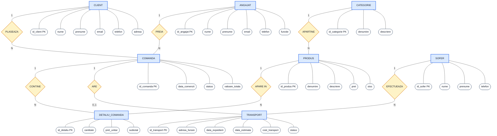

# Diagrama ER - Sistem Preluare Comenzi

```mermaid


flowchart TB
    CLIENT["CLIENT"]
    ANGAJAT["ANGAJAT"]
    COMANDA["COMANDA"]
    PRODUS["PRODUS"]
    CATEGORIE["CATEGORIE"]
    DETALIU["DETALIU_COMANDA"]
    TRANSPORT["TRANSPORT"]
    SOFER["SOFER"]

    R1{"PLASEAZA"}
    R2{"PREIA"}
    R3{"CONTINE"}
    R4{"APARE IN"}
    R5{"APARTINE"}
    R6{"ARE"}
    R7{"EFECTUEAZA"}

    CLIENT ---|"1"| R1
    R1 ---|"N"| COMANDA
    ANGAJAT ---|"1"| R2
    R2 ---|"N"| COMANDA
    COMANDA ---|"1"| R3
    R3 ---|"N"| DETALIU
    PRODUS ---|"1"| R4
    R4 ---|"N"| DETALIU
    CATEGORIE ---|"1"| R5
    R5 ---|"N"| PRODUS
    COMANDA ---|"1"| R6
    R6 ---|"0..1"| TRANSPORT
    SOFER ---|"1"| R7
    R7 ---|"N"| TRANSPORT

    CLIENT --- C1(["id_client PK"])
    CLIENT --- C2(["nume"])
    CLIENT --- C3(["prenume"])
    CLIENT --- C4(["email"])
    CLIENT --- C5(["telefon"])
    CLIENT --- C6(["adresa"])

    ANGAJAT --- A1(["id_angajat PK"])
    ANGAJAT --- A2(["nume"])
    ANGAJAT --- A3(["prenume"])
    ANGAJAT --- A4(["email"])
    ANGAJAT --- A5(["telefon"])
    ANGAJAT --- A6(["functie"])

    COMANDA --- CO1(["id_comanda PK"])
    COMANDA --- CO2(["data_comenzii"])
    COMANDA --- CO3(["status"])
    COMANDA --- CO4(["valoare_totala"])

    PRODUS --- P1(["id_produs PK"])
    PRODUS --- P2(["denumire"])
    PRODUS --- P3(["descriere"])
    PRODUS --- P4(["pret"])
    PRODUS --- P5(["stoc"])

    CATEGORIE --- CA1(["id_categorie PK"])
    CATEGORIE --- CA2(["denumire"])
    CATEGORIE --- CA3(["descriere"])

    DETALIU --- D1(["id_detaliu PK"])
    DETALIU --- D2(["cantitate"])
    DETALIU --- D3(["pret_unitar"])
    DETALIU --- D4(["subtotal"])

    TRANSPORT --- T1(["id_transport PK"])
    TRANSPORT --- T2(["adresa_livrare"])
    TRANSPORT --- T3(["data_expedierii"])
    TRANSPORT --- T4(["data_estimata"])
    TRANSPORT --- T5(["cost_transport"])
    TRANSPORT --- T6(["status"])

    SOFER --- S1(["id_sofer PK"])
    SOFER --- S2(["nume"])
    SOFER --- S3(["prenume"])
    SOFER --- S4(["telefon"])

    classDef entity fill:#dbeafe,stroke:#2563eb,color:#111827,stroke-width:2px
    classDef relation fill:#fef3c7,stroke:#d97706,color:#111827,stroke-width:2px
    classDef attribute fill:#ffffff,stroke:#64748b,color:#111827

    class CLIENT,ANGAJAT,COMANDA,PRODUS,CATEGORIE,DETALIU,TRANSPORT,SOFER entity
    class R1,R2,R3,R4,R5,R6,R7 relation
    class C1,C2,C3,C4,C5,C6,A1,A2,A3,A4,A5,A6,CO1,CO2,CO3,CO4,P1,P2,P3,P4,P5,CA1,CA2,CA3,D1,D2,D3,D4,T1,T2,T3,T4,T5,T6,S1,S2,S3,S4 attribute

```
